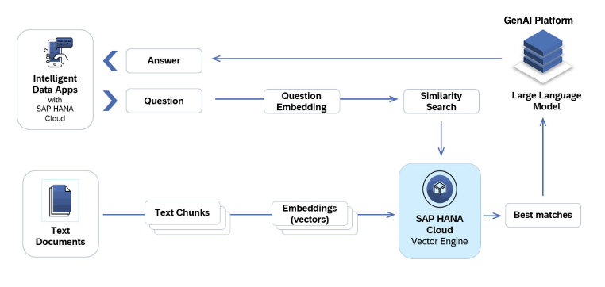

# Retrieval Augmented Generation (RAG) Usecase

## Overview

A RAG system comprises of a Semantic Search and Retrieval functionality, Leverage vector embeddings to enhance semantic search capabilities, enabling users to find relevant information quickly.

The image below gives you an idea of how the RAG use case can be built using the SAP HANA Cloud Vector Engine along with the GenAI Platform LLMs:


The following notebooks provides you with the step by step guidance on building a Retrieval Augmented Generation use case using HanaDBs Vector Search and AICores RestAPIs and PythonSDKs:

- [Retrieval Augmented Generation (RAG) use case with HanaDB using AICore RestAPI](../sap/SAP-HANA-Cloud-VectorEngine-PoC/Retrieval-Augmented-Generation_with-HanaDB-AICore-RestAPI.ipynb)
- [Retrieval Augmented Generation (RAG) use case with HanaDB using AICore PythonSDK](../sap/SAP-HANA-Cloud-VectorEngine-PoC/Retrieval-Augmented-Generation_with-HanaDB-AICore-PythonSDK.ipynb)

## Similarity Search with HanaDB:

Here we have defined a run_vector_search function which takes in a query and then provide relevant context using a similarity search function. HanaDB provides two new distance calculating similarity search function: L2Distance() and cosine_similarity(), to compute vector similarity.

**Similarity search**

```
# Wrapping HANA vector search in a function: Here we are using the Cosine Similarity as the Similarity Search function.
def run_vector_search(query: str, embedding_model, metric="COSINE_SIMILARITY", k=4):
    if metric == 'L2DISTANCE':
        sort = 'ASC'
    else:
        sort = 'DESC'
    query_vector = embedding_model.embed_query(query)
    sql = '''SELECT TOP {k} "ID", "HEADER1", "HEADER2", "TEXT"
        FROM "GRAPH_DOCU_QRC3"
        ORDER BY "{metric}"("VECTOR", TO_REAL_VECTOR('{qv}')) {sort}'''.format(k=k, metric=metric, qv=query_vector, sort=sort)
    hdf = cc.sql(sql)
    df_context = hdf.head(k).collect()
    # context = ' '.join(df_context['TEXT'].astype('string'))
    return df_context
```
