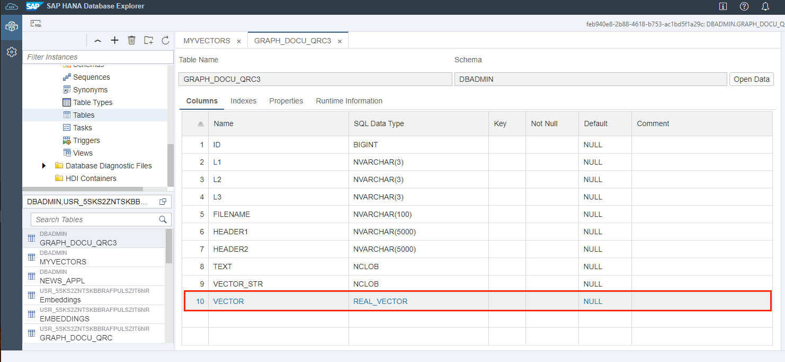

# Generating and storing embeddings inside the HANA DB

The following notebooks provides you with the step by step guidance on generating embeddings using AICores RestAPIs and PythonSDKs and storing them inside the Hana DB:

- [Generating and Storing embeddings inside HanaDB using AICore RestAPI](../sap/SAP-HANA-Cloud-VectorEngine-PoC/Generate-and-store-embeddings_with-HanaDB-AICore-RestAPI.ipynb)
- [Generating and Storing embeddings inside HanaDB using AICore PythonSDK](../sap/SAP-HANA-Cloud-VectorEngine-PoC/Generate-and-store-embeddings_with-HanaDB-AICore-PythonSDK.ipynb)

## HanaDBs new data type 'REAL_VECTOR'

A new data type named REAL_VECTOR has been introduced to encode and store the embeddings into. In the example below, we add a
new column named "VECTOR" with the newly introduced datatype "REAL_VECTOR"

**Adding a REAL_VECTOR Column to your Database**

```
# Add REAL_VECTOR column
cursor = cc.connection.cursor()
sql_command = '''ALTER TABLE GRAPH_DOCU_QRC3 ADD (VECTOR REAL_VECTOR);'''
cursor.execute(sql_command)cursor.close()

```

## New constructor "TO_REAL_VECTOR" to convert embeddings into vectors

We then can use the vector constructor TO_REAL_VECTOR, to encode vector from your generated embedding strings. Here we have the vectors inside the "VECTOR_STR" column which we feed to the TO_REAL_VECTOR constructor. This is then saved inside the "VECTOR" column

**Create Vectors from Embedding strings**

```
# Create vectors from embedding strings
cursor = cc.connection.cursor()
sql_command = '''UPDATE GRAPH_DOCU_QRC3 SET VECTOR = TO_REAL_VECTOR(VECTOR_STR);'''
cursor.execute(sql_command)
cursor.close()
```

**View the new datatype inside your HANA Database:**



## Using the "TO_NVARCHAR" function to convert vectors to embeddings

Decoding the REAL_VECTOR datatype back to vector strings. We can do this using the TO_NVARCHAR constructor. This then decodes the generation REAL_VECTOR type into embeddings:

**Decoding embeddings from vectors**

```
# The TO_NVARCHAR function is used here to dercode REAL_VECTORS into vector embeddings

hdf = cc.sql('''SELECT TOP 10 "Key", "Abstract", TO_NVARCHAR(VECTOR_RE) AS VECTOR_STR FROM NEWS_APPL2 WHERE VECTOR_RE IS NOT NULL''')
df_abstract = hdf.collect()
df_abstract
```
